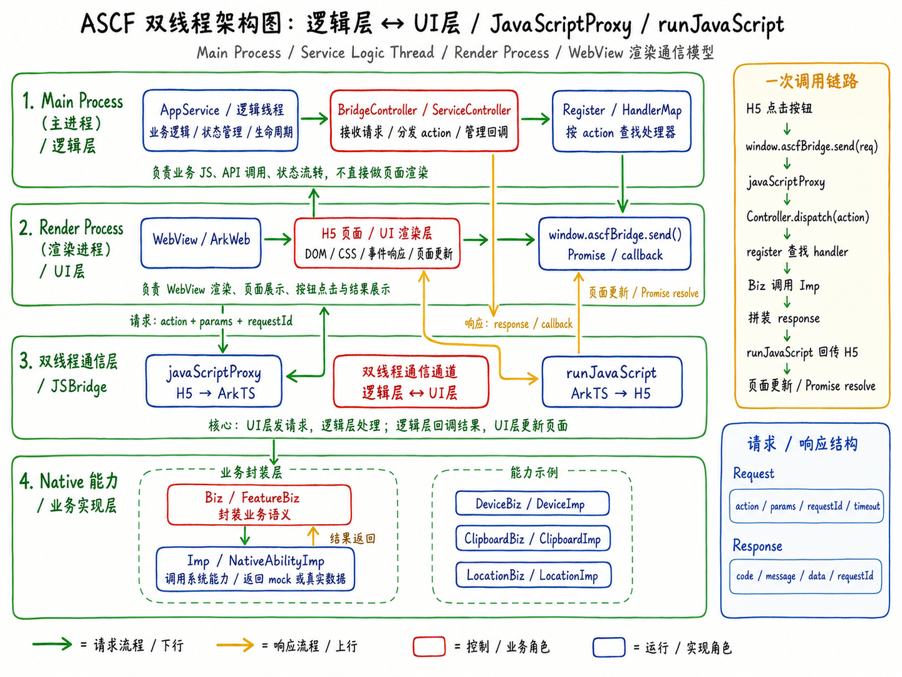

> 说明：本文不是公司内部 ASCF 源码解析，而是基于 HarmonyOS ArkWeb 官方文档、JSBridge 常见实现方式，以及 `harmony-ASCF-demo` 的代码结构整理出来的一套学习模型。真实项目里的线程名、模块名、调度实现，以公司源码为准。



## 一、问题从哪里来？

做 WebView 容器时，最容易产生一个误解：

> 不就是在鸿蒙里放一个 Web 页面吗？

一开始我也是这么理解的。

页面加载出来，按钮能点，H5 能写 JavaScript，ArkTS 能写页面，好像事情就结束了。

但是，真正维护 ASCF 这类框架时，问题通常不是“页面能不能显示”，而是下面这些：

- H5 点了按钮，为什么 ArkTS 没收到？
- ArkTS 收到了请求，为什么找不到对应能力？
- 能力执行成功了，为什么 H5 页面没有更新？
- `requestId` 丢了，为什么 Promise 一直挂着？
- 某个 API 在一个页面能调，在另一个页面不能调，是白名单、权限还是注入时机的问题？

这些问题背后，其实都指向同一件事：

> ASCF 不是简单的 WebView，而是一个“Web 页面 + 宿主能力 + 通信协议 + 能力分发”的运行时。

为了理解这个运行时，我们可以先把它抽象成一个“双线程模型”。

这里说的“双线程”，更准确地说是一种**逻辑分层模型**：

```text
逻辑层：负责业务逻辑、API 调用、状态流转、能力分发
UI 层：负责 WebView 渲染、H5 页面展示、按钮点击、结果展示
```

它不一定等于源码里真的只有两个线程，也不一定等于操作系统层面的两个固定线程。真实实现可能涉及主线程、Web 渲染线程、任务队列、Native 回调线程等。为了学习和排查问题，可以先用“逻辑层 ↔ UI 层”这个模型来理解。

## 二、为什么要拆成逻辑层和 UI 层？

原因很简单：职责不同。

H5 页面适合做这些事：

```text
展示页面
响应点击
收集参数
展示结果
```

ArkTS / Native 宿主侧适合做这些事：

```text
管理 Web 容器
注入 JSBridge
校验请求协议
根据 action 分发能力
调用系统能力或底层能力
统一封装响应
```

如果把所有事情都塞进 H5，H5 就会直接接触太多 Native 能力，安全边界会变得很模糊。

如果把所有事情都塞进 ArkTS，页面交互又会变得很笨重。

所以更合理的做法是：

```text
H5 只负责“我要调用什么能力”
ArkTS 负责“这个能力是否允许调用、由谁实现、结果怎么返回”
```

这就是 JSBridge 的价值。

## 三、官方文档里对应的能力是什么？

在 HarmonyOS ArkWeb 里，H5 和 ArkTS 通信常见有两个方向。

第一个方向是：**H5 调用 ArkTS**。

官方文档里提到，前端页面调用应用侧函数时，可以在 Web 组件初始化时使用 `javaScriptProxy()` 注册应用侧对象，也可以在 Web 组件初始化完成后使用 `registerJavaScriptProxy()` 注册对象。

在 demo 里可以理解成：

```ts
.javaScriptProxy({
  object: this.bridge,
  name: 'ascfBridge',
  methodList: ['send'],
  controller: this.controller
})
```

这段代码的意思不是“把整个 controller 扔给 H5”，而是：

```text
把 this.bridge 对象里 methodList 指定的方法，
以 window.ascfBridge.send 的形式暴露给 H5 页面。
```

所以 H5 能调用的是：

```js
window.ascfBridge.send(JSON.stringify(request))
```

而不是随便调用 ArkTS 里的所有方法。

第二个方向是：**ArkTS 回调 H5**。

这通常通过 `WebviewController.runJavaScript()` 执行 H5 里的函数来完成。官方文档也提醒过，`runJavaScript` 这类调用需要在页面加载完成后执行，比如在 `onPageEnd` 之后调用更稳妥。

在 demo 里可以理解成：

```ts
this.controller.runJavaScript(
  `window.__ascfOnResponse(${JSON.stringify(jsonStr)})`
)
```

也就是说：

```text
H5 → ArkTS：javaScriptProxy
ArkTS → H5：runJavaScript
```

这两段拼起来，才是一个完整的 JSBridge 闭环。

## 四、先看一次完整调用链路

假设 H5 页面上有一个按钮：

```html
<button onclick="callDeviceInfo()">获取设备信息</button>
```

点击后，H5 会调用：

```js
function callDeviceInfo() {
  run('getDeviceInfo')
}
```

然后进入统一封装：

```js
ascf.call(action, params, options)
```

这层封装会做三件事：

```text
1. 生成 requestId
2. 把 Promise 的 resolve/reject 存进 pending Map
3. 通过 window.ascfBridge.send 把请求发给 ArkTS
```

请求大概长这样：

```json
{
  "version": "1.0",
  "id": "req_1719200000000_1",
  "action": "getDeviceInfo",
  "params": {},
  "timeout": 5000
}
```

然后这条请求会进入 ArkTS：

```text
H5 页面
  ↓ window.ascfBridge.send(request)
javaScriptProxy
  ↓
Bridge.send(message)
  ↓
BridgeController
  ↓
BridgeProtocol
  ↓
BridgeDispatcher
  ↓
Register / HandlerMap
  ↓
Biz
  ↓
Imp
  ↓
Native / Mock Result
```

能力执行完成后，ArkTS 会生成统一响应：

```json
{
  "version": "1.0",
  "id": "req_1719200000000_1",
  "action": "getDeviceInfo",
  "code": 0,
  "message": "success",
  "data": {
    "brand": "Huawei",
    "system": "HarmonyOS"
  }
}
```

然后通过 `runJavaScript` 回传给 H5：

```js
window.__ascfOnResponse("{...response json string...}")
```

H5 页面提前定义了这个入口：

```js
window.__ascfOnResponse = function (jsonStr) {
  ascf._onResponse(jsonStr)
}
```

`_onResponse` 里会做的事情是：

```text
1. JSON.parse 解析响应
2. 根据 resp.id 找 pending[resp.id]
3. 如果 code === 0，就 resolve(resp)
4. 如果 code !== 0，就 reject(resp)
5. 最后触发 then/catch 更新页面
```

所以，H5 的数据展示不是 `__ascfOnResponse` 直接做的。

真正展示数据的是最外层的：

```js
ascf.call(action, params, options).then(function (resp) {
  showResult(resp)
}).catch(function (resp) {
  showResult(resp)
})
```

最后 `showResult` 修改 DOM：

```js
function showResult(resp) {
  var el = document.getElementById('result')
  var ok = resp && resp.code === 0
  var body = ok
    ? JSON.stringify((resp && resp.data) || {}, null, 2)
    : ('[' + (resp ? resp.code : '?') + '] ' + (resp ? resp.message : '无响应'))
  el.innerHTML = '<pre>' + body + '</pre>'
}
```

这就是一次完整的：

```text
H5 → ArkTS → Native 能力 → ArkTS → H5 页面展示
```

## 五、双线程架构怎么分层？

可以按四层理解。

### 1. Main Process / 逻辑层

这一层负责“想清楚要做什么”。

在 ASCF demo 里，它可以对应：

```text
AppService / 逻辑线程
BridgeController / ServiceController
Register / HandlerMap
```

它主要负责：

```text
业务逻辑
状态管理
生命周期
请求接收
action 分发
callback 管理
```

注意，它不应该直接做页面渲染。

它关心的是：

```text
这次请求是什么 action？
参数是否合法？
这个 action 有没有注册？
应该交给哪个 handler？
结果应该按什么协议返回？
```

### 2. Render Process / UI 层

这一层负责“把东西显示出来”。

在 demo 里，它可以对应：

```text
WebView / ArkWeb
H5 页面 / UI 渲染层
window.ascfBridge.send()
Promise / callback
```

它主要负责：

```text
WebView 渲染
DOM / CSS
按钮点击
页面更新
结果展示
```

H5 页面不应该关心 ArkTS 能力具体怎么实现。

它只需要知道：

```js
ascf.call('getDeviceInfo')
```

然后等待结果即可。

### 3. 双线程通信层 / JSBridge

这一层是最核心的桥。

它连接的是：

```text
UI 层的 H5 页面
和
逻辑层的 ArkTS 宿主代码
```

它有两个方向：

```text
H5 → ArkTS：javaScriptProxy
ArkTS → H5：runJavaScript
```

所以 JSBridge 不是一个单独的函数，而是一套双向通信机制。

更准确地说，它包括：

```text
注入对象
暴露方法
请求协议
响应协议
requestId
callback 管理
超时处理
错误码
安全校验
```

### 4. Native 能力 / 业务实现层

这一层负责“真正干活”。

在 demo 里，它可以对应：

```text
Biz / FeatureBiz
Imp / NativeAbilityImp
DeviceBiz / DeviceImp
ClipboardBiz / ClipboardImp
LocationBiz / LocationImp
```

Biz 层更像“业务语义封装”：

```text
我要获取设备信息
我要写入剪贴板
我要获取定位
```

Imp 层更像“具体能力实现”：

```text
调用系统 Kit
调用 C++ 底层能力
返回 mock 数据
做异常转换
```

这样拆的好处是：以后 mock 能力换成真实能力时，H5 和 Dispatcher 不需要大改。

## 六、为什么要有 Register 和 Dispatcher？

这是很多人一开始最容易忽略的地方。

H5 发过来的请求一般是这样：

```json
{
  "action": "getDeviceInfo",
  "params": {}
}
```

H5 不知道 ArkTS 里哪个类负责设备信息，也不应该知道。

所以中间需要一个分发器：

```text
BridgeDispatcher.dispatch(action)
```

它做的事很简单：

```text
根据 action 去 Register / HandlerMap 里找处理器
```

比如：

```text
getDeviceInfo       → DeviceHandler
getCurrentTime      → TimeHandler
openToast           → ToastHandler
getClipboardData    → ClipboardHandler
setClipboardData    → ClipboardHandler
getLocation         → LocationHandler
```

找到了，就执行。

找不到，就返回统一错误：

```json
{
  "code": 404,
  "message": "UNKNOWN_ACTION"
}
```

这就是为什么你的 demo 里要专门做“调用未知能力”的按钮。

它不是多余的，而是在验证框架是否具备兜底能力。

## 七、requestId 为什么这么重要？

因为 JSBridge 调用不是普通的同步函数调用。

H5 发出去以后，ArkTS 什么时候回，不一定。

比如：

```text
读取设备信息可能很快
获取定位可能较慢
打开授权弹窗可能更慢
网络请求可能失败
页面销毁后可能永远不回
```

所以 H5 必须用 `requestId` 记录这次调用。

H5 发请求前：

```js
pending[id] = {
  resolve,
  reject,
  timer,
  action
}
```

ArkTS 回响应时：

```js
var p = pending[resp.id]
```

找到了，说明这次响应有对应请求。

找不到，说明可能：

```text
已经超时
页面刷新了
requestId 丢了
ArkTS 回错 id 了
H5 pending 被清理了
```

所以 `requestId` 可以理解成：

> 跨层异步通信的身份证。

没有它，H5 就不知道这次 response 对应哪一次 call。

## 八、runJavaScript 回来以后，页面为什么会更新？

这一点很关键。

很多人看到：

```js
window.__ascfOnResponse = function (jsonStr) {
  ascf._onResponse(jsonStr)
}
```

会以为这里就是页面更新的地方。

其实不是。

它只是回调入口。

真正的展示链路是：

```text
runJavaScript 调用 window.__ascfOnResponse
  ↓
ascf._onResponse(jsonStr)
  ↓
JSON.parse 得到 resp
  ↓
根据 resp.id 找 pending
  ↓
执行 p.resolve(resp) 或 p.reject(resp)
  ↓
回到 ascf.call(...).then(...) / catch(...)
  ↓
showResult(resp)
  ↓
innerHTML 更新页面
```

也就是说：

> ArkTS 回来的 response，不是直接渲染页面，而是先触发 Promise，再由业务层的 then/catch 更新页面。

这也是为什么 H5 侧要写一个简单的 SDK 层 `ascf.call()`。

它把底层通信细节包起来，让页面按钮只关心：

```js
run('getDeviceInfo')
```

## 九、安全问题：为什么不能把所有方法都暴露给 H5？

`javaScriptProxy` 很方便，但也要小心。

官方 ArkWeb 安全建议提到，应该只向 Web 页面注册业务必须的 JavaScriptProxy 接口，避免把调试接口、内部逻辑接口等直接暴露给 Web 页面，并且需要做访问控制。

所以：

```ts
methodList: ['send']
```

比下面这种方式更安全：

```ts
methodList: ['send', 'dispatch', 'register', 'debug', 'getToken', 'readFile']
```

H5 只需要一个统一入口：

```js
window.ascfBridge.send(request)
```

剩下的事情交给 ArkTS：

```text
协议校验
权限判断
白名单判断
action 分发
错误兜底
```

这也是 ASCF 这种框架存在的意义。

它不是单纯提供能力，而是**受控地提供能力**。

## 十、维护 ASCF 时应该怎么排查？

如果以后遇到 “H5 调用 Native 能力失败”，不要一上来就乱改。

可以按这条链路排查：

```text
1. H5 页面按钮是否触发？
2. ascf.call 是否生成 requestId？
3. window.ascfBridge 是否存在？
4. javaScriptProxy 是否注入成功？
5. ArkTS bridge.send 是否收到消息？
6. request JSON 是否能 parse？
7. action 是否存在？
8. Register / HandlerMap 是否注册过这个 action？
9. Dispatcher 是否找到 handler？
10. Biz 参数是否校验通过？
11. Imp 是否执行成功？
12. response 是否包含原 requestId？
13. runJavaScript 是否在页面加载完成后执行？
14. H5 是否存在 window.__ascfOnResponse？
15. pending[resp.id] 是否还在？
16. then/catch 是否调用 showResult？
```

这 16 步基本可以覆盖大多数 JSBridge 问题。

如果要加日志，我建议每一层都带上 `requestId`：

```text
[H5] send request id=req_001 action=getDeviceInfo
[ArkTS] receive request id=req_001 action=getDeviceInfo
[Dispatcher] match handler id=req_001 handler=DeviceHandler
[Imp] execute success id=req_001
[ArkTS] send response id=req_001 code=0
[H5] receive response id=req_001 code=0
```

这样排查问题会舒服很多。

## 十一、这个 demo 还可以继续怎么做？

当前 demo 已经跑通了核心闭环：

```text
H5 → ArkTS → 模拟 Native 能力 → ArkTS → H5
```

后面可以继续补这些能力，让它更像一个框架维护 demo：

```text
1. action 注册表可视化
2. UNKNOWN_ACTION 统一错误码
3. requestId 全链路日志
4. 参数 schema 校验
5. 白名单拦截演示
6. 权限拒绝演示
7. Promise 超时清理
8. 页面销毁后的 callback 清理
9. clipboard / device / location / router 能力分组
10. mock 能力切换真实 ArkTS 系统能力
```

这些功能不是为了“炫技”，而是为了模拟真实框架里会遇到的问题。

ASCF 维护岗位最重要的能力，不是写一个漂亮页面，而是：

```text
看懂请求从哪里来
知道请求应该到哪里去
能判断它在哪一层断了
最后把响应按协议送回去
```

## 十二、总结

ASCF 双线程架构可以先用一句话理解：

> UI 层负责展示和交互，逻辑层负责协议、分发和能力调用，中间通过 JSBridge 做双向通信。

再展开一点：

```text
H5 调 ArkTS：javaScriptProxy
ArkTS 回 H5：runJavaScript
请求识别：requestId
action 分发：Dispatcher + Register
业务封装：Biz
能力实现：Imp
页面更新：Promise resolve/reject → showResult
```

最终完整闭环是：

```text
H5 点击按钮
  ↓
window.ascfBridge.send(request)
  ↓
javaScriptProxy
  ↓
BridgeController
  ↓
BridgeDispatcher
  ↓
Register / HandlerMap
  ↓
Biz / Imp
  ↓
生成 response
  ↓
runJavaScript 调 window.__ascfOnResponse
  ↓
H5 根据 requestId resolve Promise
  ↓
showResult 更新页面
```

如果能把这条链路讲清楚，ASCF 的核心就已经抓住了一半。

另一半，是权限、白名单、生命周期、线程切换、错误码和日志体系。

这也是后续继续维护 ASCF 框架时，最值得深入的地方。

## 参考资料

- 华为 HarmonyOS 官方文档：前端页面调用应用侧函数，说明 `javaScriptProxy()` 与 `registerJavaScriptProxy()` 的使用方式。https://developer.huawei.com/consumer/cn/doc/harmonyos-guides/web-in-page-app-function-invoking
- 华为 HarmonyOS 官方文档：WebController，说明 `runJavaScript` 的调用时机等注意事项。https://developer.huawei.com/consumer/cn/doc/harmonyos-references/arkts-basic-components-web-webcontroller
- 华为 HarmonyOS 官方文档：ArkWeb 组件安全开发，建议只暴露业务必须的 JavaScriptProxy 接口，并做访问控制。https://developer.huawei.com/consumer/cn/doc/best-practices/bpta-arkweb-component-security
- 华为 HarmonyOS 官方文档：ArkWeb 渲染框架适配，提到可通过 WebMessagePort 和 JavaScriptProxy 方式实现 JSBridge。https://developer.huawei.com/consumer/cn/doc/best-practices/bpta-arkweb_rendering_framework
